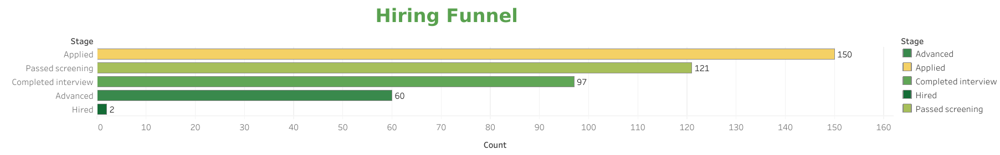
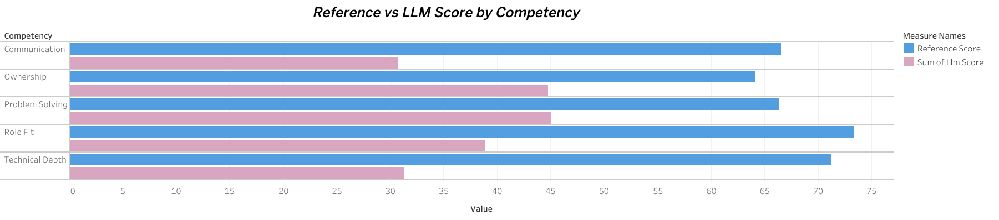
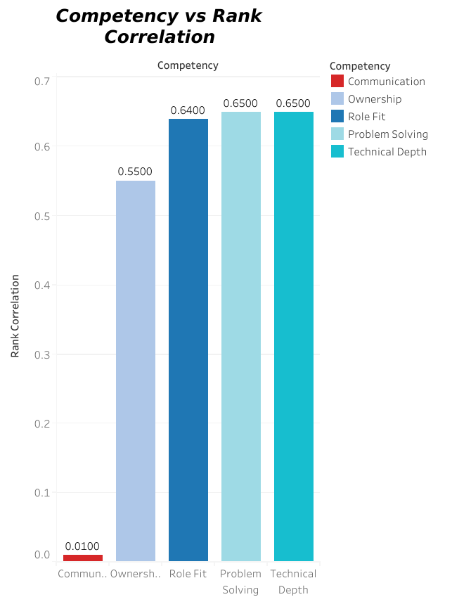

# Hiring Pipeline Analysis (PostgreSQL + Python)

A synthetic hiring-funnel dataset and analysis pipeline, modeled on the
job → candidate → interview → decision flow. Built to demonstrate
relational schema design, SQL analysis (including window functions), and
Python-based synthetic data generation.

## Tech stack

- **PostgreSQL** (hosted on [Supabase](https://supabase.com), free tier)
- **Python** (standard library only — no dependencies to install) for
  synthetic data generation
- **SQL** — joins, aggregations, `FILTER`, and window functions
  (`RANK`, `SUM() OVER`, `LAG`)

## Schema

Six tables, in dependency order:

| Table | Purpose |
|---|---|
| `jobs` | Open roles (title, department, experience level) |
| `candidates` | Applicants, linked to the job they applied for |
| `interviews` | One row per interview conducted (status, timing) |
| `screening_scores` | Pre-interview screening score per candidate |
| `interview_scores` | Per-competency scores within a completed interview |
| `recruiter_decisions` | Final Advance / Reject / Hire decision |

Full DDL is in [`schema.sql`](./schema.sql).

## Setup

1. Create a free project on [Supabase](https://supabase.com).
2. Open the **SQL Editor** and run [`schema.sql`](./schema.sql), one
   numbered block at a time.
3. Generate synthetic data:
   ```bash
   python3 generate_data.py
   ```
   This writes six CSVs to `data/`, sized to respect foreign-key
   relationships (e.g. only candidates who "pass screening" get an
   interview row).
4. In Supabase's **Table Editor**, import each CSV via
   **Insert → Import data from CSV**, in numeric order (`1_jobs.csv`
   through `6_recruiter_decisions.csv`).
5. Run the analysis queries in [`analysis_queries.sql`](./analysis_queries.sql)
   in the SQL Editor.
6. Get a free [Google Gemini API key](https://aistudio.google.com) (no
   billing setup needed for the free tier) and set it as an environment
   variable: `GEMINI_API_KEY`.
7. Generate synthetic interview transcripts and score them:
   ```bash
   pip install google-genai
   python3 generate_transcripts.py
   python3 llm_score_interviews.py
   ```
   This writes `data/interview_transcripts.csv` and `data/llm_scores.csv`.
   The model used is auto-discovered at runtime rather than hardcoded,
   since free-tier model names have changed more than once during this
   project — see [`llm_score_interviews.py`](./llm_score_interviews.py).
8. Run [`llm_schema_and_comparison.sql`](./llm_schema_and_comparison.sql)
   to create the `llm_interview_scores` table, import `llm_scores.csv`,
   and run the agreement/rank-correlation queries.

## Key findings



*(from this run's synthetic data — regenerating with a different seed will
produce different numbers)*

- **Funnel:** 150 applied → 121 passed screening → 97 completed interview →
  60 advanced → 2 hired. A realistically narrow funnel, driven by a
  deliberately high bar (avg competency score ≥ 78) for a "Hire" decision.
- **No-shows / interruptions:** ~10% of scheduled interviews each — a
  metric a real recruiting team would want to track and reduce.
- **Most interviews ≠ most hires:** Senior Data Analyst had the most
  completed interviews (16 of 21 applicants) but zero hires, while
  Data Analyst and Recruiter — smaller applicant pools — each produced
  one hire.
- **Weakest competency:** Technical Depth (67.8 avg) and Ownership (68.8)
  scored lowest across all completed interviews; Communication scored
  highest (71.0).
- **Score sanity check:** average competency score by decision was
  Hire 81.9 → Advance 69.6 → Reject 69.1 — a clean separation that
  validates the scoring logic behind the synthetic data.
- **Source effectiveness:** with only 2 hires in this sample, source data
  is too thin to draw reliable conclusions — flagged here rather than
  overstated.

## LLM scoring experiment

A separate experiment: can an LLM (Google Gemini, free tier) apply the
rubric in [`docs/scoring_rubric.md`](./docs/scoring_rubric.md) to score
candidate interview answers, and how do its scores compare to this
project's synthetic reference scores?

Full methodology, results, and limitations are written up in
[`docs/methodology.md`](./docs/methodology.md). Headline results:





- **Large absolute disagreement, but expected:** overall MAE of 33.3
  (0-100 scale) — the LLM scored every dimension 19-40 points lower than
  the reference on average. This is explained in the methodology doc:
  the reference scores were generated independently of the answer text,
  so a large gap doesn't mean either method is "wrong."
- **Moderate rank agreement on 4 of 5 dimensions:** despite the scale
  mismatch, rank correlation was 0.55-0.65 for Problem Solving, Technical
  Depth, Role Fit, and Ownership — the LLM broadly agrees on relative
  candidate ordering even where it disagrees on absolute score.
- **One unresolved anomaly:** Communication showed a rank correlation of
  0.01 — essentially no relationship — reported as an open question
  rather than explained away.

## Files

- `schema.sql` — table definitions, split into runnable steps
- `generate_data.py` — synthetic data generator (no external dependencies)
- `analysis_queries.sql` — 13 queries across funnel, scores, time-to-stage,
  source effectiveness, and window functions
- `generate_transcripts.py` — synthetic interview answer generator,
  stratified by reference-score tier
- `llm_score_interviews.py` — scores transcripts via the Gemini API
- `llm_schema_and_comparison.sql` — `llm_interview_scores` table +
  agreement/rank-correlation queries
- `docs/scoring_rubric.md` — the rubric used for LLM scoring
- `docs/methodology.md` — full write-up of the LLM scoring experiment
- `data/` — generated CSVs (funnel data + interview transcripts + LLM scores)
- `charts/` — chart images embedded in this README

## Possible extensions

- Candidate–job matching via embeddings (`pgvector`)
- A small independently human-scored sample, to give the LLM comparison
  a genuine reference point instead of only the synthetic scores
- Consistency check: score the same answer multiple times to measure
  how stable the LLM's scoring is run-to-run
